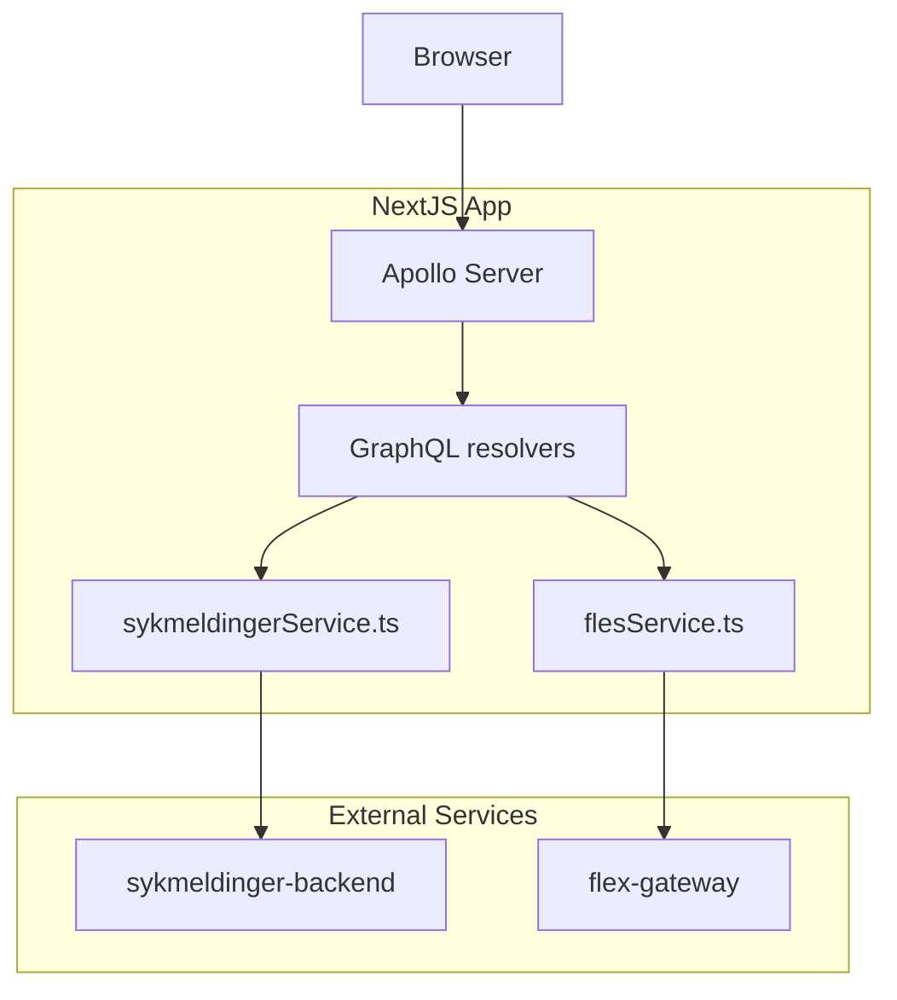

# Sykmeldinger 📝

Frontend for visning og behandling av sykmeldinger.

Lever under:

-   prod-gcp: https://www.nav.no/syk/sykmeldinger
-   dev-gcp: https://www.ekstern.dev.nav.no/syk/sykmeldinger
-   dev-gcp (demo): https://sykmeldinger.ekstern.dev.nav.no/syk/sykmeldinger/

Tekniske valg:

-   NextJS
-   apollo-server for GraphQL API.
-   apollo-client for håndtering av fetching og server state.
-   zod for validering av "ukjent" data fra diverse API.
-   vitest for enhetstesting av enkeltkomponenter.
-   playwright for ende-til-ende testing i browser.

Data-flyt:



## Kjør lokalt

### Tilgang til Github Package Registry

Siden vi bruker avhengigheter som ligger i GPR, så må man sette opp tilgang til GPR med en PAT (personal access token) som har `read:packages`. Du kan [opprette PAT her](https://github.com/settings/tokens). Dersom du har en PAT som du bruker for tilgang til maven-packages i github kan du gjenbruke denne.

I din `.bashrc` eller `.zshrc`, sett følgende miljøvariabel:

`export NPM_AUTH_TOKEN=<din PAT med read:packages>`

### Kjør appen

Installer avhengigheter, dette trenger du kun å gjøre når avhengigheter endrer seg:

```bash
yarn
```

Kjør appen i utviklingsmodus:

```bash
yarn start
```

Verifisering av appen lokalt:

-   kjør lint:

```bash
yarn lint
```

-   sjekk typescript:

```bash
yarn tsc
```

-   kjør enhetstester:

```bash
yarn test
```

-   kjør ende-til-ende tester:

```bash
yarn build:e2e && FAST=true yarn e2e:dev
```

-   bygg appen:

```bash
yarn build
```

## Test-miljø

[www.ekstern.dev.nav.no/syk/sykmeldinger](www-gcp.dev.nav.no/syk/sykmeldinger) kan nås uten naisdevice.

### Kontakt/spørsmål

Prosjektet er vedlikeholdt av [teamsykmelding](CODEOWNERS)

Spørsmål og/eller feature requests? Vennligst lag ein [issue](https://github.com/navikt/sykmeldinger/issues).

Dersom du jobber i [@navikt](https://github.com/navikt) kan du nå oss på slack
kanalen [#team-sykmelding](https://nav-it.slack.com/archives/CMA3XV997).
