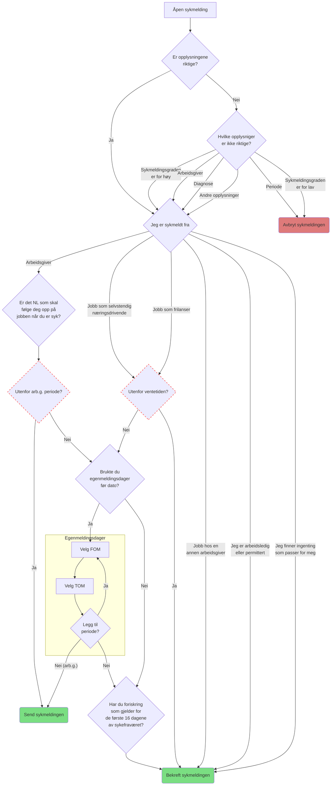

```mermaid
graph TB
    OK_APEN[Åpen sykmelding] --> OPPLYSNINGER{ Er opplysningene <br/> riktige? };

    OPPLYSNINGER -->|Ja| SYKMELDT_FRA{ Jeg er sykmeldt fra }
    OPPLYSNINGER -->|Nei| URIKTIGE_OPPLYSNINGER{ Hvilke opplysniger <br/> er ikke riktige? }

    URIKTIGE_OPPLYSNINGER -->|Sykmeldingsgraden <br/> er for høy| SYKMELDT_FRA
    URIKTIGE_OPPLYSNINGER -->|Arbeidsgiver| SYKMELDT_FRA
    URIKTIGE_OPPLYSNINGER -->|Diagnose| SYKMELDT_FRA
    URIKTIGE_OPPLYSNINGER -->|Andre opplysninger| SYKMELDT_FRA
    URIKTIGE_OPPLYSNINGER -->|Periode| AVBRYT( Avbryt sykmeldingen)
    URIKTIGE_OPPLYSNINGER -->|Sykmeldingsgraden <br/> er for lav| AVBRYT

    SYKMELDT_FRA -->|Arbeidsgiver| NAERMESTE_LEDER{ Er det NL som skal <br/> følge deg opp på <br/> jobben når du er syk? };
    SYKMELDT_FRA -->|Jobb som selvstendig <br/> næringsdrivende| UTENFOR_VENTETID{ Utenfor ventetiden? }
    SYKMELDT_FRA -->|Jobb som frilanser| UTENFOR_VENTETID
    SYKMELDT_FRA -->|Jobb hos en <br/> annen arbeidsgiver| BEKREFT
    SYKMELDT_FRA -->|Jeg er arbeidsledig <br/> eller permittert| BEKREFT
    SYKMELDT_FRA -->|Jeg finner ingenting <br/> som passer for meg| BEKREFT

    NAERMESTE_LEDER --> UTENFOR_AG_PERIODE{ Utenfor arb.g. periode? }

    UTENFOR_VENTETID -->|Nei| EGENMELDINGSDAGER{ Brukte du <br/>egenmeldingsdager <br/> før dato? }
    UTENFOR_VENTETID -->|Ja| BEKREFT( Bekreft sykmeldingen )

    EGENMELDINGSDAGER -->|Ja| FOM
    EGENMELDINGSDAGER -->|Nei| FORSIKRING

    subgraph Egenmeldingsdager
    FOM[Velg FOM] --> TOM[Velg TOM] --> NY_PERIODE{Legg til <br/> periode?} -->|Ja| FOM
    end

    NY_PERIODE -->|"Nei (arb.g.)"| SEND
    NY_PERIODE -->|Nei| FORSIKRING{Har du foriskring <br/> som gjelder for <br/> de første 16 dagene <br/> av sykefraværet?}

    FORSIKRING --> BEKREFT

    UTENFOR_AG_PERIODE -->|Ja| SEND( Send sykmeldingen )
    UTENFOR_AG_PERIODE -->|Nei| EGENMELDINGSDAGER

    style AVBRYT fill:#de7a7a
    style BEKREFT fill:#7ade82
    style SEND fill:#7ade82
    style UTENFOR_VENTETID stroke:#f66,stroke-width:2px,stroke-dasharray: 5 5
    style UTENFOR_AG_PERIODE stroke:#f66,stroke-width:2px,stroke-dasharray: 5 5
```